# Organizační chart – AIR TEAM 2026

> Poslední aktualizace: 2026-03-24
> AIR TEAM – XX zaměstnanců | AIR TEAM service – XX zaměstnanců

---

## Vizuální hierarchie

```mermaid
flowchart TD
    CEO["Petr Polák\nCEO"]

    CEO --> FIN["Finance"]
    CEO --> HR["HR"]
    CEO --> IT["IT"]
    CEO --> MKT["Marketing"]
    CEO --> SALES["Sales"]
    CEO --> OPS["Tomáš Chaloupka\nCOO – Operations"]
    CEO --> ATS["Jan Polák\nPart 145 Manager\n(AIR TEAM service)"]

    FIN --> CFO["David Kratochvíl\nCFO"]
    FIN --> ACC["Věra Gruberová\nAccounting Manager"]
    FIN --> BC["Simona Zedníčková\nBusiness Controller"]
    FIN --> OM["Věra Macková\nOffice Manager"]

    HR --> HRM["Lucie Kysučanová\nHR Manager"]

    IT --> ITM["Václav Novák\nIT Manager"]
    ITM --> JITS["Lukáš Svoboda\nJunior IT Support"]

    MKT --> MM["Pavlína Pařízková\nMarketing Manager"]
    MM --> WDS["Tomáš Hrdina\nWeb/Digital Specialist"]

    SALES --> KAM1["Jakub Dryska\nKey Account Manager"]
    SALES --> AM["Vratko Kapuš\nAccount Manager"]
    SALES --> BD1["Alex Mudrych\nBusiness Development"]
    SALES --> KAM2["Anna Ivlieva\nKey Account Manager"]
    SALES --> MROSM["Magda Ševčíková\nMRO Sales Manager"]
    SALES --> BD2["Mateusz Blicharz\nBusiness Developer"]

    OPS --> PM["Jiří Franz\nPurchasing Manager"]
    PM --> PS["Alona Ionik\nPurchasing Specialist"]

    OPS --> CSM["Šimon Navrátil\nCustomer Service Manager"]
    CSM --> CSRA["Nela Jebáčková\nCSR Associate (part-time)"]
    CSM --> OPSA["Tobiáš Sendler\nOPS Associate (part-time)"]

    OPS --> SRM["Petra Fialová\nService Repair Manager"]
    SRM --> SRC["Tomáš Studený\nService Rep. Coordinator"]

    OPS --> LW["Jan Zerák\nLogistic + Warehouse"]
    LW --> WA1["Milan Kuchynka\nWarehouse Assistant"]
    LW --> WA2["Adam Jablunka\nWarehouse Assistant"]

    subgraph ATS_service ["AIR TEAM service"]
        ATS --> CRO_group["CRO"]
        ATS --> MRO_group["MRO"]

        CRO_group --> SA["Oleksiy Panchenko\nSenior Avionics"]
        CRO_group --> AT1["Ondřej Fryauf\nAvionics Technician"]
        CRO_group --> CS["Jaroslav Kratochvíl\nCertifying Staff"]
        CRO_group --> RT1["Vítězslav Kunc\nRepair Technician"]
        CRO_group --> RT2["Vladyslav Klymenko\nRepair Technician"]

        MRO_group --> MAINT["Petr Moravčík\nMaintenance Manager"]
        MRO_group --> CMM["Kateřina Sluková\nCMM + SM"]
        MRO_group --> PROJ["Patrik Bárta\nProject Manager"]
        MRO_group --> DMM["Miroslav Kablásek\nDeputy MM"]
        MRO_group --> AE1["Viktor Kaliakin\nAvionics Engineer"]
        MRO_group --> ME1["Jakub Štefánik\nMechanical Engineer"]
        MRO_group --> ME2["Matěj Pavlíček\nMechanical Engineer"]
        MRO_group --> AE2["Bojan Andonovski\nAvionics Engineer"]
        MRO_group --> AE3["Jaroslav Karas\nAvionics Engineer"]
        MRO_group --> AE4["Jakub Vaňák\nAvionics Engineer"]
        MRO_group --> AE5["Lukáš Neděla\nAvionics Engineer"]
    end
```

---

## Tabulkový přehled zaměstnanců

### AIR TEAM

| Jméno | Pozice | Oddělení / Nadřízený |
|---|---|---|
| **Petr Polák** | CEO | – |
| David Kratochvíl | CFO | Finance |
| Věra Gruberová | Accounting Manager | Finance |
| Simona Zedníčková | Business Controller | Finance |
| Věra Macková | Office Manager | Finance |
| Lucie Kysučanová | HR Manager | HR |
| Václav Novák | IT Manager | IT |
| Lukáš Svoboda | Junior IT Support | IT / Václav Novák |
| Pavlína Pařízková | Marketing Manager | Marketing |
| Tomáš Hrdina | Web/Digital Specialist | Marketing / Pavlína Pařízková |
| Jakub Dryska | Key Account Manager | Sales |
| Vratko Kapuš | Account Manager | Sales |
| Alex Mudrych | Business Development | Sales |
| Anna Ivlieva | Key Account Manager | Sales |
| Magda Ševčíková | MRO Sales Manager | Sales |
| Mateusz Blicharz | Business Developer | Sales |
| **Tomáš Chaloupka** | COO | Operations |
| Jiří Franz | Purchasing Manager | Operations / Tomáš Chaloupka |
| Alona Ionik | Purchasing Specialist | Operations / Jiří Franz |
| Šimon Navrátil | Customer Service Manager | Operations / Tomáš Chaloupka |
| Nela Jebáčková | CSR Associate (part-time) | Operations / Šimon Navrátil |
| Tobiáš Sendler | OPS Associate (part-time) | Operations / Šimon Navrátil |
| Petra Fialová | Service Repair Manager | Operations / Tomáš Chaloupka |
| Tomáš Studený | Service Rep. Coordinator | Operations / Petra Fialová |
| Jan Zerák | Logistic + Warehouse | Operations / Tomáš Chaloupka |
| Milan Kuchynka | Warehouse Assistant | Operations / Jan Zerák |
| Adam Jablunka | Warehouse Assistant | Operations / Jan Zerák |

### AIR TEAM service

| Jméno | Pozice | Sekce / Nadřízený |
|---|---|---|
| **Jan Polák** | Part 145 Manager | AIR TEAM service |
| Oleksiy Panchenko | Senior Avionics | CRO / Jan Polák |
| Ondřej Fryauf | Avionics Technician | CRO / Jan Polák |
| Jaroslav Kratochvíl | Certifying Staff | CRO / Jan Polák |
| Vítězslav Kunc | Repair Technician | CRO / Jan Polák |
| Vladyslav Klymenko | Repair Technician | CRO / Jan Polák |
| Petr Moravčík | Maintenance Manager | MRO / Jan Polák |
| Kateřina Sluková | CMM + SM | MRO / Jan Polák |
| Patrik Bárta | Project Manager | MRO / Jan Polák |
| Miroslav Kablásek | Deputy MM | MRO / Jan Polák |
| Viktor Kaliakin | Avionics Engineer | MRO / Jan Polák |
| Jakub Štefánik | Mechanical Engineer | MRO / Jan Polák |
| Matěj Pavlíček | Mechanical Engineer | MRO / Jan Polák |
| Bojan Andonovski | Avionics Engineer | MRO / Jan Polák |
| Jaroslav Karas | Avionics Engineer | MRO / Jan Polák |
| Jakub Vaňák | Avionics Engineer | MRO / Jan Polák |
| Lukáš Neděla | Avionics Engineer | MRO / Jan Polák |

---

## Legenda

| Zkratka | Význam |
|---|---|
| CEO | Chief Executive Officer |
| COO | Chief Operating Officer |
| CFO | Chief Financial Officer |
| CRO | Continued Roadworthiness Organisation |
| MRO | Maintenance, Repair & Overhaul |
| CMM + SM | Certifying Maintenance Manager + Safety Manager |
| Deputy MM | Deputy Maintenance Manager |
| CSR | Customer Service Representative |
| OPS | Operations |
| Part 145 | Certifikace pro údržbu letadel dle EASA Part 145 |

---

*Zdroj: AIR TEAM org. chart (prezentace), verze 2026-03-24*
